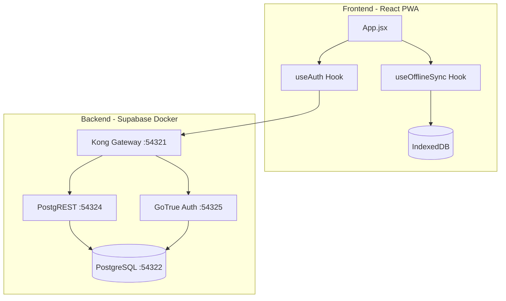
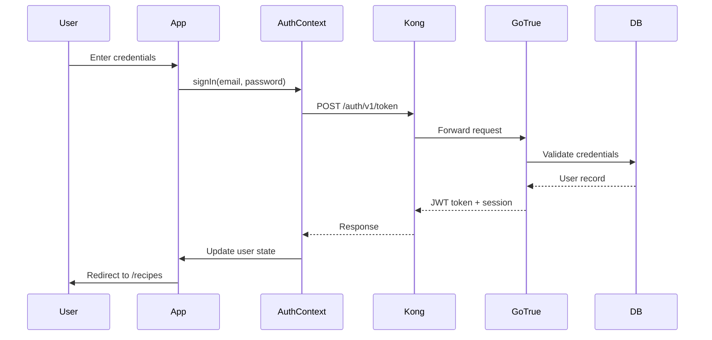
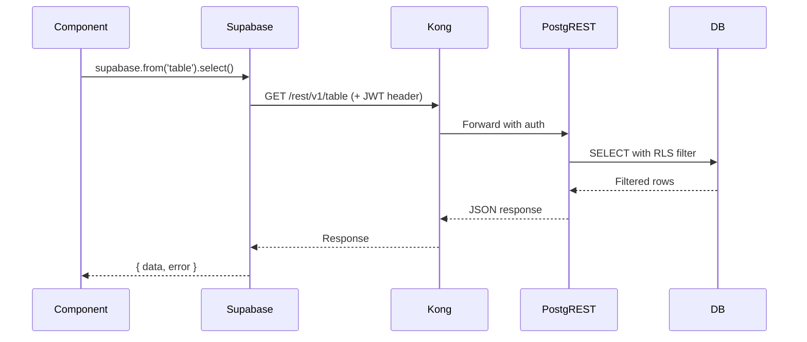

# System Architecture

## Overview

Recipe App is a monorepo containing a React PWA frontend and a self-hosted Supabase backend running in Docker.

## Monorepo Structure

```
recipe-app/
├── apps/
│   └── web/              # React PWA (Vite)
├── supabase/             # Self-hosted Supabase (Docker)
├── docs/                 # Documentation
├── scripts/              # Build/utility scripts
└── Makefile              # Development commands
```

## Architecture Diagram



## Frontend Architecture

### Tech Stack
- **React 19** - UI library with hooks
- **Vite 7** - Build tool and dev server
- **React Router v7** - Client-side routing
- **TailwindCSS v4** - Utility-first CSS
- **IndexedDB** - Offline data storage

### Component Hierarchy

```
App (BrowserRouter)
├── AuthProvider (Context)
│   ├── PublicRoute
│   │   ├── Login
│   │   └── Register
│   └── ProtectedRoute
│       ├── RecipesList / RecipeDetail / RecipeForm
│       ├── IngredientsList / IngredientForm
│       ├── ShoppingLists / ShoppingListDetail
│       └── PantryList
```

### State Management

| State Type | Solution | Use Case |
|------------|----------|----------|
| Auth state | React Context (`useAuth`) | User session, login/logout |
| Server data | Local state + Supabase | Recipes, ingredients, lists |
| Offline queue | IndexedDB (`useOfflineSync`) | Pending sync operations |
| UI state | Local `useState` | Forms, modals, loading |

### Routing

```jsx
// Public routes (redirect to /recipes if logged in)
/login              → Login
/register           → Register

// Protected routes (redirect to /login if not authenticated)
/recipes            → RecipesList
/recipes/new        → RecipeForm (create)
/recipes/:id        → RecipeDetail
/recipes/:id/edit   → RecipeForm (edit)
/ingredients        → IngredientsList
/ingredients/new    → IngredientForm (create)
/ingredients/:id/edit → IngredientForm (edit)
/shopping           → ShoppingLists
/shopping/:id       → ShoppingListDetail
/pantry             → PantryList

// Default: / → /recipes
```

## Backend Architecture

### Self-Hosted Supabase

All services run in Docker via `docker-compose.yml`. See [docker.md](docker.md) for details.

| Service | Purpose |
|---------|---------|
| **Kong** | API Gateway - routes requests to services |
| **PostgreSQL** | Primary database with RLS |
| **PostgREST** | Auto-generated REST API from schema |
| **GoTrue** | Authentication (email/password) |
| **Storage** | File storage (not currently used) |
| **Studio** | Web UI for database management |
| **Meta** | Database metadata for Studio |

### API Routes (Kong Gateway)

```
http://localhost:54321/
├── /rest/v1/*     → PostgREST (database queries)
├── /auth/v1/*     → GoTrue (authentication)
└── /storage/v1/*  → Storage API
```

## Data Flow

### Authentication Flow



### Data Query Flow



## Offline Sync Flow

The app supports offline usage for shopping lists.

```mermaid
flowchart TD
    subgraph Online
        A[Load shopping list] --> B[Cache to IndexedDB]
        B --> C[Display items]
    end
    
    subgraph Offline
        D[User checks item] --> E[Update IndexedDB]
        E --> F[Queue pending operation]
        F --> G[Display optimistic update]
    end
    
    subgraph Reconnect
        H[Network restored] --> I[Get pending ops]
        I --> J[Sync to Supabase]
        J --> K[Clear pending queue]
        K --> L[Refresh from server]
    end
```



### IndexedDB Stores

| Store | Purpose |
|-------|---------|
| `shopping_items` | Cached shopping list items |
| `pending_ops` | Operations waiting to sync |
| `active_list` | Currently active list metadata |

### Sync Operations

```javascript
// Operation types queued for sync
{
  type: "update_item",    // Update item (checked, quantity)
  type: "delete_item",    // Remove item from list
  type: "insert_item"     // Add new item to list
}
```

## Security

### Row Level Security (RLS)

All user data tables have RLS policies:

```sql
-- Users can only access their own data
USING (auth.uid() = user_id)
WITH CHECK (auth.uid() = user_id)
```

### JWT Authentication

- Tokens issued by GoTrue with 1-hour expiry
- Auto-refresh enabled in Supabase client
- Session persisted in localStorage
- All API requests include JWT in Authorization header

## PWA Features

- **Service Worker**: Caches static assets
- **IndexedDB**: Offline data storage
- **Network Detection**: `navigator.onLine` + event listeners
- **Optimistic Updates**: Immediate UI feedback
- **Background Sync**: Queue operations when offline
