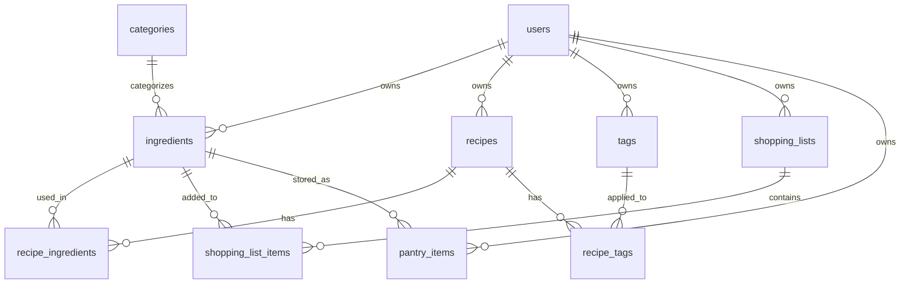

# Database Schema Reference

## Entity Relationship Diagram



## Table Overview

| Table | RLS | Purpose |
|-------|-----|---------|
| `auth.users` | Supabase | User accounts (managed by GoTrue) |
| `categories` | Public | Global ingredient categories |
| `units` | Public | Global measurement units |
| `ingredients` | Yes | User's ingredient library |
| `recipes` | Yes | Recipe definitions |
| `recipe_ingredients` | Yes | Recipe-ingredient junction with quantities |
| `tags` | Yes | User's recipe tags |
| `recipe_tags` | Yes | Recipe-tag associations |
| `shopping_lists` | Yes | Shopping list metadata |
| `shopping_list_items` | Yes | Items in shopping lists |
| `pantry_items` | Yes | User's pantry inventory |

---

## Tables

### auth.users (Supabase managed)
```sql
id          uuid PRIMARY KEY
email       text
role        text  -- 'authenticated' for logged-in users
created_at  timestamptz
```

---

### categories
Global ingredient categories (no RLS - readable by all).

```sql
id         uuid PRIMARY KEY DEFAULT gen_random_uuid()
name       text NOT NULL UNIQUE
sort_order integer NOT NULL DEFAULT 0
created_at timestamptz NOT NULL DEFAULT now()
```

**Default categories (Norwegian):**
1. Grønnsaker
2. Frukt
3. Kjøtt
4. Fisk og sjømat
5. Meieriprodukter
6. Egg
7. Korn og kornprodukter
8. Belgfrukter
9. Poteter og rotfrukter
10. Nøtter og frø
11. Krydder og urter
12. Oljer og fett
13. Søtning og sukker
14. Sauser og dressinger
15. Plantebaserte alternativer
16. Drikke

---

### units
Global measurement units (no RLS - readable by all).

```sql
id         uuid PRIMARY KEY DEFAULT gen_random_uuid()
name       text NOT NULL UNIQUE
unit_type  text NOT NULL CHECK (unit_type IN ('count', 'weight', 'volume', 'kitchen', 'package'))
sort_order integer NOT NULL DEFAULT 0
created_at timestamptz NOT NULL DEFAULT now()
```

**Unit types:**

| Type | Units (Norwegian) |
|------|-------------------|
| `count` | stk, skive, bit, filet, porsjon |
| `weight` | g, kg, mg |
| `volume` | ml, dl, l |
| `kitchen` | ts, ss, klype, kopp |
| `package` | bunt, håndfull, pose, pakke, boks, glass, beger, tube, kartong, flaske |

---

### ingredients
User's ingredient library.

```sql
id           uuid PRIMARY KEY DEFAULT gen_random_uuid()
user_id      uuid NOT NULL REFERENCES auth.users(id) ON DELETE CASCADE
name         text NOT NULL
category     text NULL      -- e.g., "Grønnsaker", "Kjøtt"
default_unit text NULL      -- e.g., "g", "stk", "dl"
created_at   timestamptz NOT NULL DEFAULT now()
updated_at   timestamptz NOT NULL DEFAULT now()

UNIQUE (user_id, name)
```

---

### recipes
Recipe definitions.

```sql
id           uuid PRIMARY KEY DEFAULT gen_random_uuid()
user_id      uuid NOT NULL REFERENCES auth.users(id) ON DELETE CASCADE
title        text NOT NULL
description  text NULL
instructions text NULL       -- Free text instructions
servings     integer NULL CHECK (servings > 0)
created_at   timestamptz NOT NULL DEFAULT now()
updated_at   timestamptz NOT NULL DEFAULT now()
```

---

### recipe_ingredients
Junction table linking recipes to ingredients with quantities.

```sql
id            uuid PRIMARY KEY DEFAULT gen_random_uuid()
user_id       uuid NOT NULL REFERENCES auth.users(id) ON DELETE CASCADE
recipe_id     uuid NOT NULL REFERENCES recipes(id) ON DELETE CASCADE
ingredient_id uuid NOT NULL REFERENCES ingredients(id) ON DELETE RESTRICT
quantity      numeric(12,3) NULL CHECK (quantity >= 0)
unit          text NULL
note          text NULL      -- e.g., "hakket", "romtemperert"
created_at    timestamptz NOT NULL DEFAULT now()
updated_at    timestamptz NOT NULL DEFAULT now()

UNIQUE (recipe_id, ingredient_id)
```

---

### tags
Recipe tags for categorization.

```sql
id         uuid PRIMARY KEY DEFAULT gen_random_uuid()
user_id    uuid NOT NULL REFERENCES auth.users(id) ON DELETE CASCADE
name       text NOT NULL
color      text NULL       -- Hex color code
created_at timestamptz NOT NULL DEFAULT now()
updated_at timestamptz NOT NULL DEFAULT now()

UNIQUE (user_id, name)
```

---

### recipe_tags
Junction table for recipe-tag relationships.

```sql
id         uuid PRIMARY KEY DEFAULT gen_random_uuid()
recipe_id  uuid NOT NULL REFERENCES recipes(id) ON DELETE CASCADE
tag_id     uuid NOT NULL REFERENCES tags(id) ON DELETE CASCADE
created_at timestamptz NOT NULL DEFAULT now()

UNIQUE (recipe_id, tag_id)
```

---

### shopping_lists
Shopping list metadata.

```sql
id         uuid PRIMARY KEY DEFAULT gen_random_uuid()
user_id    uuid NOT NULL REFERENCES auth.users(id) ON DELETE CASCADE
name       text NOT NULL
status     text NOT NULL DEFAULT 'draft' CHECK (status IN ('draft', 'active', 'completed'))
created_at timestamptz NOT NULL DEFAULT now()
updated_at timestamptz NOT NULL DEFAULT now()
```

---

### shopping_list_items
Items in a shopping list.

```sql
id               uuid PRIMARY KEY DEFAULT gen_random_uuid()
user_id          uuid NOT NULL REFERENCES auth.users(id) ON DELETE CASCADE
shopping_list_id uuid NOT NULL REFERENCES shopping_lists(id) ON DELETE CASCADE
ingredient_id    uuid NOT NULL REFERENCES ingredients(id) ON DELETE CASCADE
quantity         numeric(12,3) NULL CHECK (quantity >= 0)
unit             text NULL
checked          boolean NOT NULL DEFAULT false
recipe_source_id uuid NULL REFERENCES recipes(id) ON DELETE SET NULL  -- Which recipe added this
created_at       timestamptz NOT NULL DEFAULT now()
updated_at       timestamptz NOT NULL DEFAULT now()
```

---

### pantry_items
What the user has at home.

```sql
id            uuid PRIMARY KEY DEFAULT gen_random_uuid()
user_id       uuid NOT NULL REFERENCES auth.users(id) ON DELETE CASCADE
ingredient_id uuid NOT NULL REFERENCES ingredients(id) ON DELETE CASCADE
quantity      numeric(12,3) NULL CHECK (quantity >= 0)
unit          text NULL
created_at    timestamptz NOT NULL DEFAULT now()
updated_at    timestamptz NOT NULL DEFAULT now()

UNIQUE (user_id, ingredient_id)
```

---

## Row Level Security (RLS)

All user data tables have RLS enabled with these policy patterns:

```sql
-- SELECT: Users can only see their own data
CREATE POLICY "Users can only see own data"
ON public.table_name FOR SELECT
USING (auth.uid() = user_id);

-- INSERT: Users can only insert their own data
CREATE POLICY "Users can only insert own data"
ON public.table_name FOR INSERT
WITH CHECK (auth.uid() = user_id);

-- UPDATE: Users can only update their own data
CREATE POLICY "Users can only update own data"
ON public.table_name FOR UPDATE
USING (auth.uid() = user_id)
WITH CHECK (auth.uid() = user_id);

-- DELETE: Users can only delete their own data
CREATE POLICY "Users can only delete own data"
ON public.table_name FOR DELETE
USING (auth.uid() = user_id);
```

**Public tables** (`categories`, `units`) have no RLS - readable by all authenticated users.

---

## Trigger Functions

### Auto-seed ingredients for new users

When a user signs up, they automatically get a library of ~150 common Norwegian ingredients.

```sql
-- Trigger on auth.users
CREATE TRIGGER on_auth_user_created_seed_ingredients
  AFTER INSERT ON auth.users
  FOR EACH ROW
  EXECUTE FUNCTION public.handle_new_user_ingredients();

-- Function calls seed_default_ingredients(user_id)
-- Only seeds if user has no existing ingredients
```

### Sync recipe ingredients to shopping lists

When recipe ingredients change, shopping lists that include that recipe are automatically updated.

**Triggers on `recipe_ingredients`:**

| Trigger | Event | Action |
|---------|-------|--------|
| `recipe_ingredient_added_sync` | INSERT | Add ingredient to shopping lists containing recipe |
| `recipe_ingredient_removed_sync` | DELETE | Remove ingredient from shopping lists (if unchecked) |
| `recipe_ingredient_updated_sync` | UPDATE | Update quantity/unit in shopping lists (if unchecked) |

**Key behaviors:**
- Only affects `draft` and `active` lists (not `completed`)
- Only removes/updates unchecked items (preserves user modifications)
- Avoids duplicates when adding

---

## Default Data

### Categories (16 total)
Seeded in migration `006_categories_units.sql`. Norwegian category names.

### Units (25 total)
Seeded in migration `006_categories_units.sql`. Organized by type (count, weight, volume, kitchen, package).

### Default Ingredients (~150)
Seeded per-user via `seed_default_ingredients()` function. Includes:
- Vegetables (31 items)
- Root vegetables (8 items)
- Fruits (9 items)
- Meat (16 items)
- Fish & seafood (12 items)
- Dairy (18 items)
- Eggs (1 item)
- Grains (17 items)
- Legumes (6 items)
- Nuts & seeds (9 items)
- Spices & herbs (19 items)
- Oils (5 items)
- Sweeteners (5 items)
- Sauces (18 items)
- Plant-based alternatives (5 items)

---

## Common Queries

### Get ingredients with category
```sql
SELECT * FROM ingredients 
WHERE user_id = auth.uid() 
ORDER BY name;
```

### Get recipe with all ingredients
```sql
SELECT 
  r.*,
  ri.quantity, ri.unit, ri.note,
  i.name as ingredient_name, i.category
FROM recipes r
LEFT JOIN recipe_ingredients ri ON r.id = ri.recipe_id
LEFT JOIN ingredients i ON ri.ingredient_id = i.id
WHERE r.id = $1;
```

### Get shopping list with items and ingredient details
```sql
SELECT 
  sli.*,
  i.name, i.category
FROM shopping_list_items sli
JOIN ingredients i ON sli.ingredient_id = i.id
WHERE sli.shopping_list_id = $1
ORDER BY i.category, i.name;
```

### Get shopping list with pantry comparison
```sql
SELECT 
  sli.*,
  i.name, i.category,
  pi.quantity as pantry_quantity, pi.unit as pantry_unit
FROM shopping_list_items sli
JOIN ingredients i ON sli.ingredient_id = i.id
LEFT JOIN pantry_items pi ON sli.ingredient_id = pi.ingredient_id 
  AND pi.user_id = auth.uid()
WHERE sli.shopping_list_id = $1;
```

---

## Error Codes

| Code | Meaning | Common Cause |
|------|---------|--------------|
| 23503 | Foreign key violation | Deleting ingredient used in recipes |
| 23505 | Unique constraint violation | Duplicate ingredient name |
| 42501 | RLS policy violation | Accessing another user's data |

---

## Migrations

| File | Purpose |
|------|---------|
| `001_init_recipes.sql` | Initial schema (recipes, ingredients) |
| `002_rls_recipes.sql` | RLS policies for recipes |
| `003_tags.sql` | Tags and recipe_tags |
| `004_shopping_lists.sql` | Shopping lists schema |
| `005_rls_shopping.sql` | RLS for shopping |
| `006_categories_units.sql` | Global categories and units |
| `007_ingredient_unique_with_unit.sql` | Unique constraint update |
| `008_ingredient_cascade_delete.sql` | Cascade delete setup |
| `009_default_ingredients.sql` | Auto-seed function |
| `010_fix_user_role.sql` | Role fixes |
| `011_sync_recipe_ingredients_to_shopping.sql` | Shopping list sync triggers |
