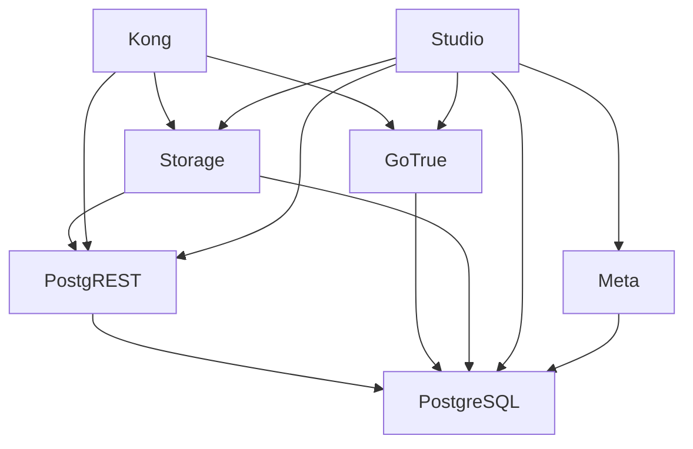

# Docker Setup

## Overview

The backend runs as self-hosted Supabase using 7 Docker containers orchestrated via `docker-compose.yml`.

## Service Overview

| Service | Container | Port | Image | Purpose |
|---------|-----------|------|-------|---------|
| **kong** | supabase-kong | 54321 | kong:2.8 | API Gateway |
| **db** | supabase-db | 54322 | postgres:15 | PostgreSQL database |
| **studio** | supabase-studio | 54323 | supabase/studio:latest | Web UI |
| **rest** | supabase-rest | 54324 | postgrest/postgrest:v9.0.1 | REST API |
| **auth** | supabase-auth | 54325 | supabase/gotrue:v2.158.1 | Authentication |
| **storage** | supabase-storage | 54326 | supabase/storage-api:v1.11.13 | File storage |
| **meta** | supabase-meta | 54327 | supabase/postgres-meta:v0.95.2 | DB metadata |

## Port Mapping

```
Host Port → Container Port → Service
─────────────────────────────────────
54321    → 8000           → Kong (API Gateway - main entry point)
54322    → 5432           → PostgreSQL
54323    → 3000           → Supabase Studio
54324    → 3000           → PostgREST
54325    → 9999           → GoTrue Auth
54326    → 5000           → Storage API
54327    → 8080           → Postgres Meta
```

## Makefile Commands

```bash
make up        # Start all services: cd supabase && docker compose up -d
make down      # Stop all services: cd supabase && docker compose down
make dev       # Start frontend: cd apps/web && npm run dev
make build     # Build frontend: cd apps/web && npm run build
make logs      # View logs: cd supabase && docker compose logs -f
make restart   # Restart services: cd supabase && docker compose restart
```

## Startup Procedure

1. **Start services**: `make up`
2. **Wait for healthy**: ~30 seconds for all containers
3. **Access Studio**: http://localhost:54323
4. **Start frontend**: `make dev`
5. **Open app**: http://localhost:5173

## Service Dependencies



## Kong API Gateway Routes

Defined in `kong.yml`:

```yaml
services:
  - name: rest
    url: http://rest:3000
    routes:
      - paths: ["/rest/v1"]
        strip_path: true

  - name: auth
    url: http://auth:9999
    routes:
      - paths: ["/auth/v1"]
        strip_path: true

  - name: storage
    url: http://storage:5000
    routes:
      - paths: ["/storage/v1"]
        strip_path: true
```

### API Endpoints

```
http://localhost:54321/
├── /rest/v1/table_name     # Database queries (PostgREST)
├── /auth/v1/signup         # User registration
├── /auth/v1/token          # Login (get JWT)
├── /auth/v1/user           # Current user info
├── /auth/v1/logout         # End session
└── /storage/v1/object/*    # File upload/download
```

### CORS Configuration

Kong handles CORS globally:

```yaml
plugins:
  - name: cors
    config:
      origins: ["*"]
      methods: ["GET","POST","PUT","PATCH","DELETE","OPTIONS","HEAD"]
      headers: 
        - Authorization
        - Content-Type
        - apikey
        - x-client-info
        - x-supabase-api-version
```

## Environment Variables

### Required (`supabase/.env`)

```env
# Database
POSTGRES_PASSWORD=your-secure-password
POSTGRES_DB=postgres
POSTGRES_USER=postgres

# JWT (generate with scripts/generate-keys.js)
JWT_SECRET=your-jwt-secret-min-32-chars
ANON_KEY=eyJhbGciOiJIUzI1NiIs...
SERVICE_ROLE_KEY=eyJhbGciOiJIUzI1NiIs...

# URLs
SITE_URL=http://localhost:5173
API_EXTERNAL_URL=http://localhost:54321
STUDIO_PORT=54323

# Studio
PG_META_CRYPTO_KEY=your-encryption-key
```

### Service-Specific Variables

| Service | Key Variables |
|---------|---------------|
| **db** | `POSTGRES_PASSWORD`, `POSTGRES_DB`, `POSTGRES_USER` |
| **rest** | `PGRST_DB_URI`, `PGRST_JWT_SECRET`, `PGRST_DB_ANON_ROLE` |
| **auth** | `GOTRUE_JWT_SECRET`, `GOTRUE_SITE_URL`, `GOTRUE_DB_DATABASE_URL` |
| **storage** | `ANON_KEY`, `SERVICE_KEY`, `DATABASE_URL` |
| **kong** | `KONG_DECLARATIVE_CONFIG` (path to kong.yml) |
| **studio** | `SUPABASE_URL`, `SUPABASE_ANON_KEY`, `STUDIO_PG_META_URL` |

## Data Persistence

Docker volumes store persistent data:

```yaml
volumes:
  supabase_db_data2:     # PostgreSQL data
  supabase_storage_data: # Uploaded files
```

To reset database:
```bash
make down
docker volume rm recipe-backend_supabase_db_data2
make up
```

## Troubleshooting

### Check container status
```bash
docker compose -f supabase/docker-compose.yml ps
```

### View specific service logs
```bash
docker logs supabase-kong -f
docker logs supabase-db -f
docker logs supabase-auth -f
```

### Common Issues

| Issue | Solution |
|-------|----------|
| Port already in use | `docker compose down` or change ports in `.env` |
| Auth not working | Check `JWT_SECRET` matches in all services |
| API returns 401 | Verify `ANON_KEY` is correct and not expired |
| Studio can't connect | Ensure `meta` service is running |
| DB connection refused | Wait for `db` to be healthy, check password |

### Restart single service
```bash
docker compose -f supabase/docker-compose.yml restart auth
```

### Rebuild without cache
```bash
docker compose -f supabase/docker-compose.yml build --no-cache
docker compose -f supabase/docker-compose.yml up -d
```
